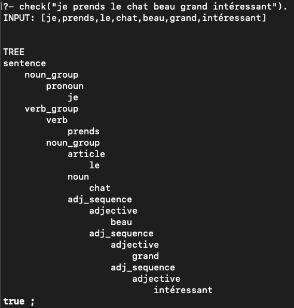
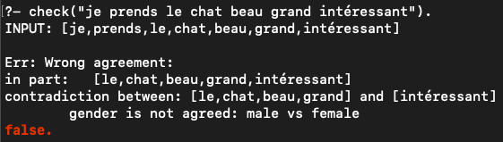

# Syntax analysis of the French language

## Installation and run
- Download and install [swi-prolog](https://www.swi-prolog.org/Download.html)
- Run ```swipl.pl syntax_analysis.pl```

## Request example
Run ```swipl.pl syntax_analysis.pl```  

```?- check("je prends le chat beau grand intéressant").```  
  


```?- check("je prends le chat beau grand intéressant").```  
  


## How it works

The solution is based on a simple context-free grammar that describes a small subset of the French language. Difference lists are explicitly used for unification, although the Prolog has its own syntax for this process (search for ```-->``` in swi Prolog).  

## Grammar for french:  

We consider a subset of the language with the present tense.  
! The grammar describes only the order of the components of the language, without agreement.  

```
Sentence -> NounGroup VerbGroup
NounGroup ->
    Pronoun |
    Article Noun | 
    Article Noun AdjSequence | 
AdjSequence -> 
    Adjective |
    AdverbAdj Adjective |
    Adjective AdjSequence | 
    AdverbAdj Adjective AdjSequence
VerbGroup -> Verb | Verb Adverb | Verb NounGroup | Verb Adverb NounGroup
```

## Vocabulary

In the file ***vocabulary_french.pl***  
